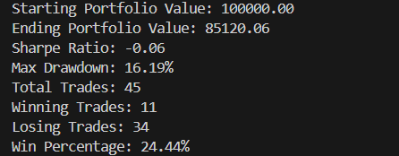

# Trading Algorithms with Python

This project implements a backtesting script for a trading strategy with Backtrader.

1. **Clone the Repository**

   ```sh
   git clone <repository-url>
   cd trading-algorithm

2. **Set Up Virtual Environment**
   
   Create a virtual environment to isolate dependencies. Open the terminal and enter:
   
   ```
   python -m venv venv
   ```
   
   Activate the virtual environment
   - On Windows:
   ```
   venv\Scripts\activate
   ```
   
   - On macOS/Linux:
   ```
   source venv/bin/activate
   ```
   
   After activation, your terminal prompt should change (e.g., ``(venv)``), indicating you're in the virtual environment

   4. **Install Dependencies**

   ```sh
   pip install -r requirements.txt

5. **Backtest a strategy**
   
   Example: Testing EMABollingerStrategy on 4-hour timeframe
   ```sh
   python3 backtest.py --csv data/gold_4h_data_cleaned.csv --strategy ema_bollinger --plot-file backtest_plot.png

## Example Results


## Library
- BackTrader Python: https://www.backtrader.com/docu/quickstart/quickstart/

## Data
The historical XAUUSD data (4-hour) is downloaded from: 
- https://www.kaggle.com/datasets/novandraanugrah/xauusd-gold-price-historical-data-2004-2024

The historical Gold (Futures 4H & 15min) data is retrieved from yfinance
